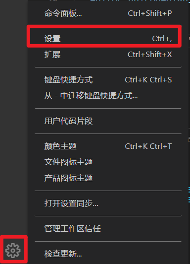
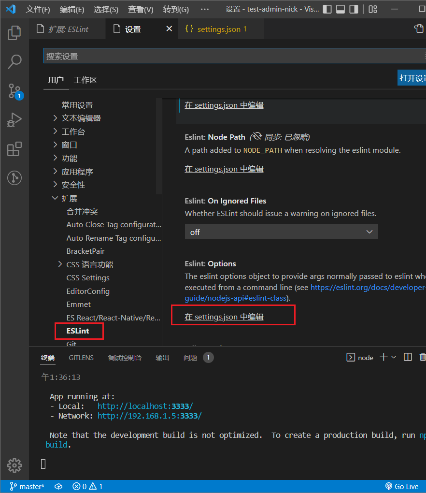
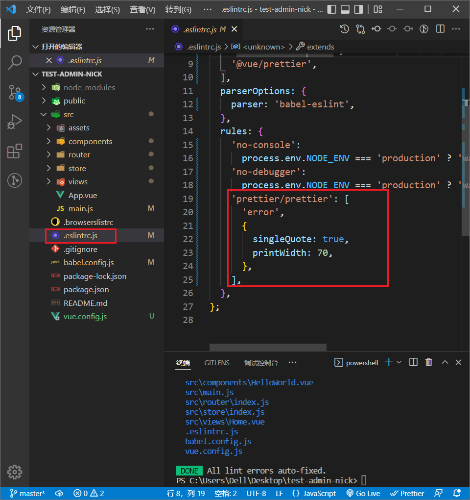

### 第1集 构建vue项目的利器——脚手架vue-cli3

1. 安装node

   查看是否安装成功：`node -v`

2. 安装vue-cli3

   ```js
   npm install -g @vue/cli
   ```

   查看是否安装成功：`vue -v`

3. 创建项目

   - vue create project
   - vue init webpack project

4. CLI服务

   - 脚本名更改

   - Cli3启动方式是vue-cli-service serve

     

5. 生成的目录结构介绍

   3.0的目录简单了很多，少了build、config两个目录。需要对webpack进行配置的话，要手动在根目录新建一个`vue.config.js`文件。

6. vue.config.js常用配置

   ```js
   module.exports = {
       // 基本路径，vue.cli 3.3以前请使用baseURL
       publicPath: '/',
       // 输出文件目录
       outputDir: 'dist',
       // 用于嵌套生成的静态资源(js, css, img, fonts)的目录
       assetsDir: '',
       // 生产环境sourceMap
       productionSourceMap: true,
       // webpack配置
       configureWebpack: () => {},
       chainWebpack: () => {},
       // css相关配置
       css: {
           // 启用css module
           modules: false,
           // 是否使用css分离插件
           extract: true,
           // 开启css source maps?
           sourceMap: false,
           // css 预设器配置项
           loaderOptions: {},
       },
       // webpack-dev-server 相关配置
       devServer: {
           host: '0.0.0.0',
           port: 8080,
           open: true, // 自动打开浏览器
           proxy: {}, // 设置代理
       },
       // 第三方插件配置
       pluginOptions: {
           // ...
       }
   }
   ```


### 第2集 vue中的组件间传值的几种方式

- 父子组件通信

  - props/$emit
  - `$parent/$children`
  - $ref

- 非父子之间通信

  - 事件总线 

  - `$attrs/$listeners`

    > 解决多级组件传值的问题
    >
    > $attr 将父组件中不包括props 的属性传入子组件，通常配合inheritAttrs 选项一起使用
    >
    > $listeners监听子组件中数据变化，传递给父组件
  
    外层组件：
  
    ```vue
    // 这里的v-bind的不能简写
    <Parent :msg="a" :msgb='b' :msgc="c"></Parent>
    <script>
    export default {
      name: 'Father',
      data() {
        return {
          a: '10',
          b: '20',
          c: '30'
        }
      },
    }
    </script>
    ```
  
    父组件：
  
    ```vue
    <Child v-bind="$attrs"></Child> // 父组件中有子组件
    ```
  
    子组件接收值：
  
    ```vue
    // 在mounted输出结果你就能看到数据(除了props里面的数据)
    console.log('attrs', this.$attrs);
    ```
  


- vuex


### 第3集 项目开始

#### eslint的配置

1. 在vscode插件中下载eslint插件。

2. 设置eslint：

   - 点设置

     

   - 扩展 ---》ESLint ---> 在`settings.json`中编辑

     

   - 在`settings.json`中添加一下配置：

     ```js
     // 每次保存的时候将代码按eslint格式进行修复
     "eslint.autoFixonSave": true,
     // 添加vue支持
     "eslint.validate": [
         "javascript",
         "javascriptreact",
         {
             "language": "vue",
             "autoFix": true
         }
     ]
     ```

   - 最后在.eslintrc.js中配置：

     


双引号保存变单引号：

在项目根目录下新建文件：`.prettierrc.json`

```json
//内容：
{
  "singleQuote": true,
  "semi": false
}
```


#### 需求分析及模块划分

- 分析视频管理后台需要的功能(4个页面)
  - 可视化展示数据
    - 视频的成交量
    - 用户总量
    - 订单总额
  - 登录页
  - 视频管理
    - 上传视频
    - 更新视频
    - 删除视频
    - 查看已有视频
  - 用户管理
    - 更新用户信息
    - 删除用户
    - 新增用户
    - 权限管理
  
- 设计对应页面
  - 首页用来展示数据
    - 使用Echarts柱状图、折线图及饼图展示
    
  - 视频管理页、用户管理页
  
    - 选用el-table-form展示和编辑数据
    - el-dialog组件实现编辑和新增功能
  
    

#### 使用vuex实现切换tab页功能

- 在`main.vue`中引入`CommonTab.vue`组件
- 在vuex中定义存储`tagList`，方便非父子组件传递数据。
- 定义vuex侧边栏点击后将菜单加入到`tagList`中的方法
- 定义vuex中点击标签后触发删除的方法

#### 构建页面组件，连通公共组件

- 建立每个页面组件
- 连通面包屑
- 连通侧边栏
- 连通标签栏

#### 路由重复点击报错

跟版本有关系，只要你的vue-router的版本是3.0以上，就会有这种情况出现，你只需要重新安装一下插件就行。`npm i vue-router@3.0`

#### 介绍mock.js及axios全局配置

- Mock.js

  - 作用：生成随机数据，拦截Ajax请求。

  - 安装：

    ```js
    yarn add mockjs
    
    npm i mockjs
    ```

    

  - 核心：

    - Mock.mock()：用来拦截Ajax请求

      ```js
      // 根据数据模板生成模拟数据
      Mock.mock(rurl, rtype, template);
      
      /**
      	rurl: 表示需要拦截的 URL，可以是 URL 字符串或 URL 正则
      	eg. /\/domain\/list\.json/、'/domain/list.json'
      */
      ```

      

  - `Mock.Random()`

    - 生成随机数据

#### 谈谈封装一个ECharts组件的一些想法

- 图标的大分类

- 组件的一些动态参数抽离

- 组件的基本配置

- echarts图表分两种：

  - 有坐标轴的。如柱状图
  - 没有坐标轴的。如饼图

- 主体颜色

  ```js
  color: [
      "#2ec7c9",
      "#b6a2de",
      "#5ab1ef",
  ]
  ```

  


